Absolutely. I can structure a complete Figma-ready UI system for the travel/airline website we were working on, including the model screens, layout, colors, typography, components, and responsive states.

✈️ Travel Website — Full Figma Structure

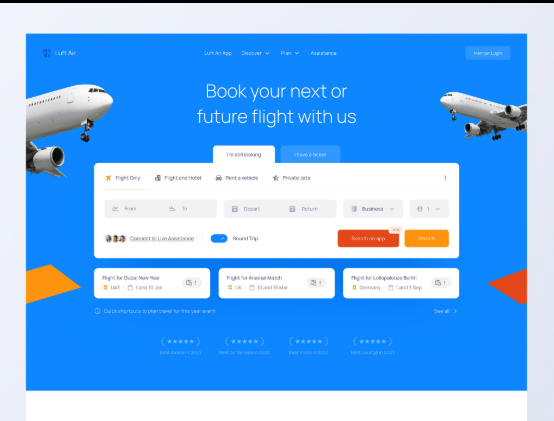
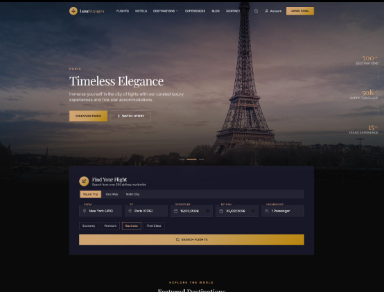
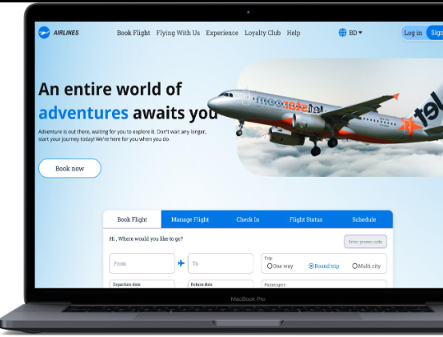
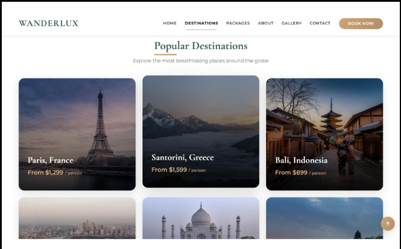
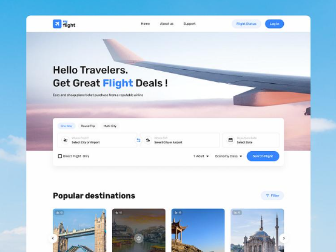
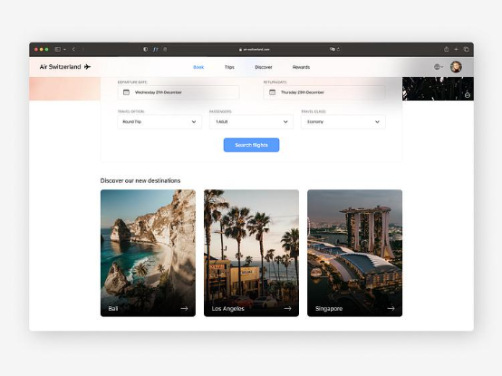
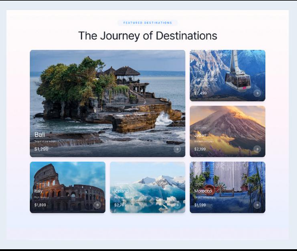

7
1. Figma Pages

Create your Figma file with these pages:

📁 TRAVEL WEBSITE
│
├── 🎨 01 — Design System
├── 🏠 02 — Homepage
├── ✈️ 03 — Flight Search
├── 🛫 04 — Flight Results
├── 💳 05 — Booking & Checkout
├── 🎫 06 — Booking Confirmation
├── 🌍 07 — Destinations
├── 🏨 08 — Hotels
├── 🧳 09 — Travel Packages
├── 👤 10 — User Account
├── 📱 11 — Mobile Screens
└── 🧩 12 — Components
🎨 2. Design System
Primary colors
Color	Hex	Usage
Deep Navy	#071A2B	Header, footer, dark sections
Ocean Blue	#0B6EFD	Primary buttons/actions
Sky Blue	#48B9FF	Highlights
Sand	#F5EBDD	Travel sections
Off White	#F8FAFC	Page background
White	#FFFFFF	Cards
Dark	#111827	Main text
Gray	#6B7280	Secondary text
Green	#16A34A	Success
Red	#DC2626	Errors
Typography

I recommend:

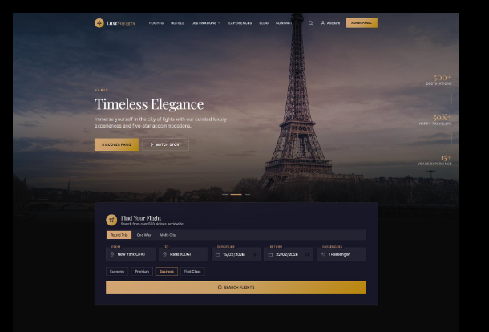

Headings: Montserrat
Body: Arial or Inter

For example:

H1 — Montserrat Bold — 56px
H2 — Montserrat Bold — 40px
H3 — Montserrat SemiBold — 28px

Body Large — Arial — 18px
Body — Arial — 16px
Small — Arial — 14px

Yes — Arial is perfectly fine for the body. It gives the interface a clean, familiar feel while Montserrat gives the travel brand more personality.

🏠 3. Homepage
Desktop: 1440 × 1024

Structure:

┌───────────────────────────────────────────────┐
│ LOGO     Explore   Flights   Hotels   Deals   │
│                              Login  Sign Up    │
├───────────────────────────────────────────────┤
│                                               │
│       [ LARGE DESTINATION IMAGE ]             │
│                                               │
│       Discover the world                      │
│       Your journey starts here.               │
│                                               │
│       [ Explore destinations ]                │
│                                               │
│ ┌─────────────────────────────────────────┐   │
│ │ ROUND TRIP  ONE WAY  MULTI CITY         │   │
│ │                                         │   │
│ │ From       →       To                   │   │
│ │ Lagos              London               │   │
│ │                                         │   │
│ │ Departure    Return    Travelers        │   │
│ │ Sep 12       Sep 20    1 Adult          │   │
│ │                                         │   │
│ │             [ Search Flights ]           │   │
│ └─────────────────────────────────────────┘   │
│                                               │
├───────────────────────────────────────────────┤
│ Popular destinations                          │
│                                               │
│ [ Paris ] [ Dubai ] [ London ] [ Cape Town ] │
│                                               │
├───────────────────────────────────────────────┤
│ Why travel with us?                           │
│                                               │
│  ✓ Best Price   ✓ Secure Booking   ✓ Support │
│                                               │
├───────────────────────────────────────────────┤
│ Travel inspiration                            │
│                                               │
│ [ Large article ] [ Article ] [ Article ]     │
│                                               │
├───────────────────────────────────────────────┤
│ Newsletter                                   │
│                                               │
├───────────────────────────────────────────────┤
│ Footer                                        │
└───────────────────────────────────────────────┘
Hero

Use a real high-quality travel image as the background.

Add:

background-image
        ↓
dark transparent overlay
        ↓
white text
        ↓
booking/search card

The overlay can be approximately:

background: linear-gradient(
  90deg,
  rgba(7, 26, 43, .80),
  rgba(7, 26, 43, .25)
);

This makes the text readable without destroying the image.

✈️ 4. Flight Search Page

When the user clicks Search Flights:

┌───────────────────────────────────────────────┐
│ ← Search flights                              │
├───────────────────────────────────────────────┤
│                                               │
│ Lagos → London                                │
│ Sep 12 – Sep 20 • 1 Passenger                 │
│                                               │
│ [ Modify search ]                             │
├──────────────┬────────────────────────────────┤
│ FILTERS      │ 24 flights found               │
│              │                                │
│ Stops        │ ┌────────────────────────────┐ │
│ ○ Direct     │ │ BA        10:30 → 17:45   │ │
│ ○ 1 stop     │ │ Lagos     London           │ │
│              │ │                            │ │
│ Price        │ │ ₦1,240,000    [Select]    │ │
│ ─────●────   │ └────────────────────────────┘ │
│              │                                │
│ Airlines     │ ┌────────────────────────────┐ │
│ □ BA         │ │ Emirates  14:20 → 06:40   │ │
│ □ Emirates   │ │ Lagos     London           │ │
│ □ Qatar      │ │                            │ │
│              │ │ ₦1,380,000    [Select]    │ │
└──────────────┴────────────────────────────────┘
🛫 5. Flight Details

After selecting a flight:

Flight Details

Lagos → London

10:30
LOS
Lagos

──────── ✈ ────────

17:45
LHR
London

Duration
7h 15m

Economy
1 Carry-on
1 Checked bag
Meal included

────────────────────

Price breakdown

Flight             ₦1,050,000
Taxes              ₦120,000
Service fee         ₦70,000

Total              ₦1,240,000

[ Continue to passenger details ]
👤 6. Passenger Information
Passenger details

Contact information

First name       [____________]
Last name        [____________]
Email            [____________]
Phone            [____________]

Passenger 1

Date of birth    [____________]
Nationality      [____________]
Passport number  [____________]

☐ Save passenger information

[ Continue to payment ]
💳 7. Payment Page

Make this page very clean.

┌─────────────────────────┬─────────────────────┐
│ Payment                 │ Trip summary        │
│                         │                     │
│ ○ Card                  │ Lagos → London      │
│ ○ Bank Transfer         │ Sep 12              │
│ ○ Wallet                │                     │
│                         │ British Airways     │
│ Card number             │                     │
│ [___________________]   │ Flight       ₦...  │
│                         │ Taxes        ₦...   │
│ Expiry      CVV         │                     │
│ [_____]     [____]      │ TOTAL        ₦...   │
│                         │                     │
│ [ Pay securely ]        │                     │
└─────────────────────────┴─────────────────────┘

Add a small:

🔒 Secure payment

under the payment button.

🎫 8. Booking Confirmation

This should feel rewarding.

             ✓

       Booking confirmed!

       Your trip is booked.

       Booking reference
          TL8K92P

┌────────────────────────────┐
│ Lagos          →    London │
│ Sep 12                 Sep │
│                            │
│ British Airways            │
│ BA 74                       │
└────────────────────────────┘

[ View booking ]

[ Download ticket ]

[ Add to calendar ]
🌍 9. Destinations Page

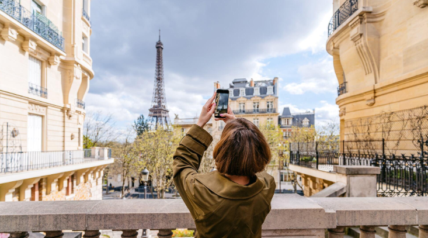
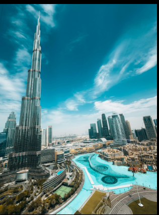
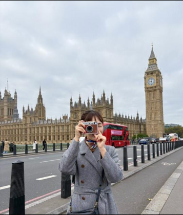
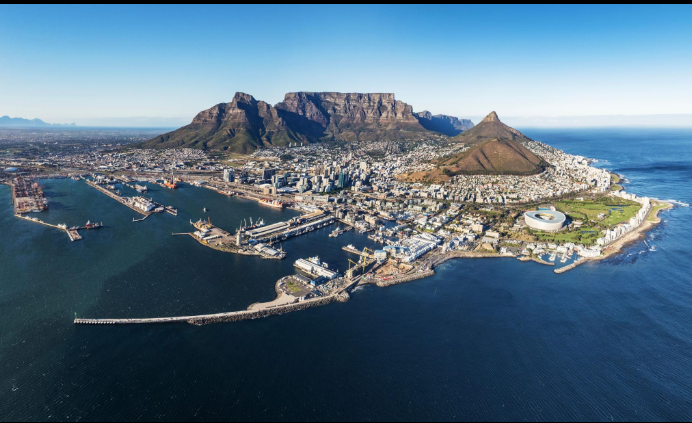
4

Hero:

Explore the world

Discover places worth experiencing.

[ Search destinations... ]

Then:

Popular destinations

┌───────────┐ ┌───────────┐ ┌───────────┐
│           │ │           │ │           │
│   PARIS   │ │   DUBAI   │ │  LONDON   │
│           │ │           │ │           │
└───────────┘ └───────────┘ └───────────┘

Each card:

Image
Paris, France
From ₦850,000
★★★★★
[ Explore ]
🏨 10. Hotels Page
Find your perfect stay

[ Destination ]
[ Check in ]
[ Check out ]
[ Guests ]

             [ Search ]

Recommended hotels

┌─────────────┐
│    IMAGE    │
├─────────────┤
│ The Savoy   │
│ London      │
│ ★★★★★       │
│ ₦250,000/n  │
│ [ View ]    │
└─────────────┘
🧳 11. Travel Packages

This is where you introduce the adventure aspect of the website.
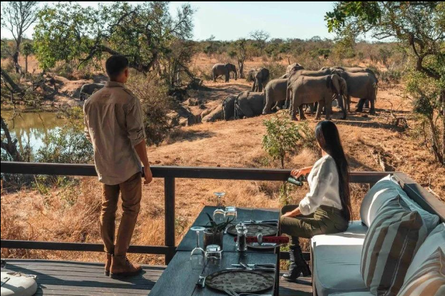
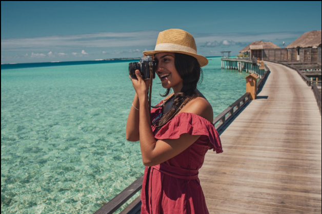

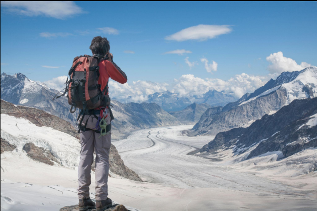
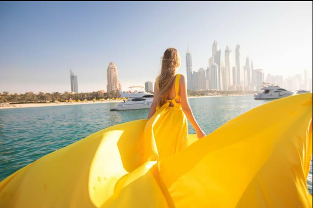
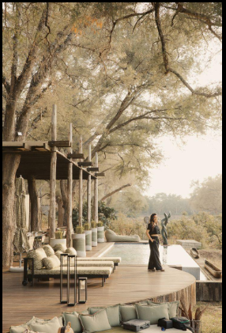
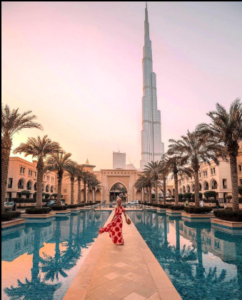

7
Section

Travel beyond the flight.

Cards:

7 Days in Dubai
Flight + Hotel + Tours

From ₦2,400,000

[ Explore package ]
Cape Town Adventure
Flight + Hotel + Safari

From ₦1,800,000

[ Explore package ]

This differentiates your website from a basic airline booking interface.

👤 12. User Dashboard
┌──────────────────────────────────────────────┐
│ My Trips                                     │
├────────────┬─────────────────────────────────┤
│ Dashboard  │ Welcome back, Philip            │
│ My Trips   │                                 │
│ Bookings   │ Upcoming trip                   │
│ Saved      │                                 │
│ Profile    │ Lagos → London                  │
│ Settings   │ Sep 12                          │
│            │ British Airways                 │
│            │ [ View trip ]                   │
│            │                                 │
│            │ Past trips                      │
│            │ [ Paris ] [ Dubai ] [ Nairobi ] │
└────────────┴─────────────────────────────────┘
📱 13. Mobile UI

Design at:

390 × 844

Mobile navigation:

┌──────────────────────┐
│ ☰     LOGO      👤   │
├──────────────────────┤
│                      │
│ Discover the world   │
│                      │
│ Your journey starts  │
│ here.                │
│                      │
│ [ Explore ]          │
│                      │
│ ┌──────────────────┐ │
│ │ Flights          │ │
│ │                  │ │
│ │ From             │ │
│ │ Lagos            │ │
│ │                  │ │
│ │ To               │ │
│ │ London           │ │
│ │                  │ │
│ │ Departure        │ │
│ │ Sep 12           │ │
│ │                  │ │
│ │ [ Search ]       │ │
│ └──────────────────┘ │
│                      │
│ Popular destinations │
│                      │
│ ← [Paris] [Dubai] →  │
└──────────────────────┘

Bottom navigation:

⌂ Home
✈ Trips
🌍 Explore
♡ Saved
👤 Profile
🧩 14. Components Page

Your Figma components should include:

Navigation
Desktop navbar
Mobile navbar
Dropdown menu
Profile menu
Buttons
Primary
Secondary
Outline
Ghost
Disabled
Loading
Forms
Input
Search input
Date picker
Select
Passenger selector
Airport selector
Cards
Destination card
Flight card
Hotel card
Package card
Blog card
Feedback
Success
Error
Warning
Notification
Toast
Other
Modal
Dropdown
Tabs
Accordion
Pagination
Breadcrumb
Rating
Skeleton loader
🎯 The overall visual direction

I'd make the website feel like:

Airline booking + premium travel agency + adventure platform

Rather than just:

"Book a flight."

The brand message becomes:

Discover more. Travel further. Experience everything.

That gives you three major user journeys:

✈️ Fly → Search and book flights
🏨 Stay → Find hotels
🌍 Explore → Discover destinations and experiences

And your homepage should visually prioritize:

Hero → Flight search → Popular destinations → Travel packages → Why us → Travel inspiration → Newsletter → Footer

If you're building this in Figma for your portfolio, this is enough to turn into a fairly complete case-study project rather than just a single landing page.